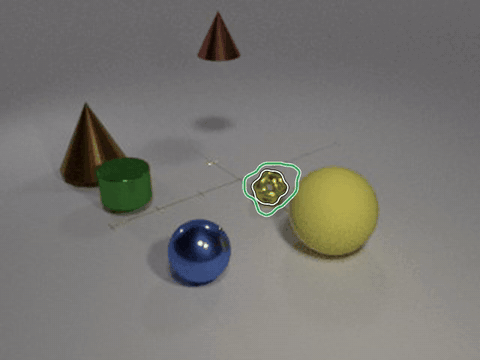

# iSEE: Object Permanence through Self-Supervision

[Project page](https://insait-institute.github.io/iSEE/)

<p align="center">
  
</p>
<p align="center"><em>iSEE on LA-CATER: the target (white) is covered by nested cones and carried, out of sight for
7.0 s. Green: iSEE's estimate of the target, dashed while it is hidden.</em></p>

## Abstract

Object permanence, keeping track of an object's identity and position while it is occluded, is central to video
representations that track, predict and plan. Trackers that achieve it learn from boxes, track identities and
visibility labels. On the other hand, self-supervised object-centric methods discover objects without labels: through
slot attention, it represents a video as slots that bind to objects and follow them across frames. However, these
slots are lost under occlusion, making the desired permanence impossible. Reasoning permanence is a hard problem
because it requires to detect when an object becomes occluded, re-identify when object reappears, and keep the
object's hidden position continuous, using reappearance as the only learning cue. To address this, we propose iSEE, a
novel framework that offers all three aforementioned requirements, without any labels whatsoever. We built iSEE using
the following three proposed components: (i) Object evidence modelling: a slot's attention, compared with its own
past, reveals when its object is hidden. (ii) Appearance-position separation: two slot streams let the appearance be
held for re-identification while the position keeps changing. (iii) Permanence from reappearance: a walker follows the
hidden object's position, trained only on where the object reappears. On LA-CATER static, iSEE returns a reappearing
object to its own slot after 86 % of occlusions, against 32 % for SlotContrast, and localises it while hidden within
4.1 mAP of the label-trained SoTA RAM. The two streams also allow downstream planning, with the position stream as the
action of a world model.

This repository contains the model, the training code for the encoder and the walker, the evaluation on LA-CATER
(static and moving camera) and MOVi-C, and the trained checkpoints.

## Installation

```bash
conda create -n isee python=3.11 -y && conda activate isee
pip install -r requirements.txt
```

Tested with PyTorch 2.14 (CUDA 13.0) and timm 1.0.30 on NVIDIA RTX A6000 and H200 GPUs. The frozen
backbone, `nope_coco_dv2_vits14_reg4.pth` from [DINO-SAW](https://huggingface.co/rmdocherty/dino-saw), is downloaded
into `checkpoints/` on first use and verified by its sha256.

## Checkpoints

`checkpoints/` holds the trained models (the backbone's weights are not part of them):

| file | what |
|---|---|
| `isee_lacater_static.safetensors` | encoder, LA-CATER static camera |
| `isee_lacater_moving.safetensors` | encoder, LA-CATER moving camera |
| `isee_movi_c.safetensors` | encoder, MOVi-C |
| `walker_lacater_{static,moving}_seed{0,1,2}.safetensors` | walkers, three seeds per camera, used as an ensemble |

Each dataset has one config in `configs/` that names its checkpoints and holds every setting of the model, its
training and its evaluation.

## Running on a video

```bash
python scripts/infer.py configs/lacater_static.yaml --video path/to/clip.mp4 --out outputs/infer --tf32
```

writes `outputs/infer/<clip>.npz` (TEN's held flags, the slots, the decoder's masks and every slot's position) and
`outputs/infer/<clip>.mp4` (the reported position of every held slot, next to the segmentation).

## Data

The code downloads no dataset. Each preparation script documents what it reads.

**LA-CATER, static camera.** Download `test_data.zip`, `train_data_part_1.zip` and `train_data_part_2.zip` from the
[LA-CATER page](https://avivsham.github.io/op_net/), then

```bash
python scripts/prepare_lacater.py static --downloads <folder with the zips> --out data/la_cater
```

**LA-CATER, moving camera.** Download `la_cater_moving.tar.gz`
(`https://tri-ml-public.s3.amazonaws.com/datasets/la_cater_moving.tar.gz`, from [RAM](https://github.com/TRI-ML/RAM)),
then

```bash
python scripts/prepare_lacater.py moving --tarball la_cater_moving.tar.gz --out data/la_cater_moving
```

which packs the JPEG frames of each clip, unchanged, into one MJPEG video.

**LA-CATER masks.** The permanence and discovery metrics need each object's visible (modal) mask, and the pixels of
the object rendered alone. We rendered them from the dataset's scene files for the evaluated clips. Download
`lacater_masks.zip` (148 MB) from this repository's [releases](../../releases), then

```bash
unzip lacater_masks.zip -d data/
```

which gives `data/lacater_masks/{static,moving}/<clip>.npz` (format in `isee/eval/lacater.py`, `read_masks`).

**MOVi-C.** The preparation script reads `movi_c/256x256:1.0.0` through TensorFlow Datasets from the public bucket
`gs://kubric-public/tfds` (or from a local copy, `--data-dir`) and needs TensorFlow, which the model does not:

```bash
pip install tensorflow tensorflow-datasets
python scripts/prepare_movi_c.py --out data/movi_c                        # both splits, about 48 GB
python scripts/prepare_movi_c.py --out data/movi_c --splits validation    # evaluation only, 1.5 GB
```

## Evaluation

```bash
python scripts/eval_lacater.py configs/lacater_static.yaml
python scripts/eval_lacater.py configs/lacater_moving.yaml
python scripts/eval_movi_c.py configs/movi_c.yaml
```

Each script runs the model over its evaluation set, writes the model's outputs under `outputs/<config name>/` (an
interrupted run resumes), scores them on the CPU, prints the tables and writes the scores with their definitions to
`outputs/<config name>/results.json`. Settings come from each config's `evaluation` block. The metrics are defined
in `isee/eval/`; the occlusions scored are listed in `eval_sets/`.

### Results

The numbers these commands give with the released checkpoints. All are percentages, and higher is better.

**Table 1, position while hidden (LA-CATER).** Own-box mAP@[0.1:0.3] on the hidden frames of each label: the box of
the slot that followed the snitch until it disappeared, placed at that slot's reported position on every hidden frame
(`isee/eval/lacater.py`). *frozen* keeps iSEE's slot at its last visible position. 195 occlusions (static camera) and
388 (moving camera).

| | static: occluded | contained | carried | moving: occluded | contained | carried |
|---|---|---|---|---|---|---|
| frozen | 57.8 | 56.7 | 41.9 | 51.3 | 32.2 | 13.6 |
| iSEE | 80.6 | 84.2 | 78.7 | 54.3 | 51.6 | 46.3 |

**Table 2, re-identification after an occlusion.** SAME: the share of occlusions after which the slot that owns the
object is the slot that owned it before, by the length of the occlusion in frames (24 fps). Scored: 183 of 195
occlusions (static camera) and 360 of 388 (moving camera).

| | 5-25 | 25-50 | 50-100 | >=100 | all |
|---|---|---|---|---|---|
| LA-CATER, static camera | 95.1 | 86.4 | 91.8 | 77.5 | 86.3 |
| LA-CATER, moving camera | 81.3 | 81.7 | 75.8 | 64.2 | 75.8 |

**Table 3, object discovery.** Video FG-ARI and video mBO of the decoder's masks, all frames of a clip pooled
(`isee/eval/segmentation.py`): the 250 MOVi-C validation clips and the first 150 LA-CATER test clips.

| | MOVi-C | LA-CATER static | LA-CATER moving |
|---|---|---|---|
| video FG-ARI | 71.8 | 96.9 | 89.3 |
| video mBO | 36.1 | 24.0 | 17.6 |

The numbers were computed on an NVIDIA RTX A6000 with the settings of each config's `evaluation` block: LA-CATER with
frames resized on the GPU and TF32 matrix products, MOVi-C with frames resized on the CPU and in float32. TEN's hold
decisions are discrete, so another GPU, precision or library version changes a few of them and moves the numbers
slightly.

## Training

**Encoder.**

```bash
python scripts/train_encoder.py configs/lacater_static.yaml --out runs/lacater_static
```

100k steps (LA-CATER: batch 32 of 8-frame windows; MOVi-C: batch 64 of 4-frame windows); the schedule,
precision, seed and checkpoint selection are in the config's `training` block. Rerunning the command resumes from
`runs/<name>/latest.pt`. The released encoders were each trained on one NVIDIA H200; LA-CATER's batch of 32 does not
fit in the 48 GB of an RTX A6000.

**Walker** (LA-CATER). The walker is trained on the trained encoder's own outputs: its patch features, every slot's
position stream and TEN's held flags over the first 2000 training clips.

```bash
python scripts/build_walker_data.py configs/lacater_static.yaml
python scripts/train_walker.py configs/lacater_static.yaml --seed 0 --out runs/walker_lacater_static_seed0
```

(repeat for seeds 1 and 2; a walker's batch of 16 needs more than the 48 GB of an RTX A6000). The walker learns from
returns: a slot that TEN holds and later releases must be found where it reappears; 8 pseudo-hides per clip (a visible
slot treated as held for 1 to 8 steps) add training rows. The config's `walker_training` block holds every setting. To
evaluate retrained models, point the config's `checkpoint` and `walker.checkpoints` at them.

## Repository structure

```
assets/                      the teaser
configs/                     one config per dataset: model, TEN, walker, training and evaluation settings
  lacater_static.yaml  lacater_moving.yaml  movi_c.yaml
checkpoints/                 the trained encoders and walkers (see Checkpoints)
eval_sets/                   the occlusions scored: lacater_static.json, lacater_moving.json
isee/
  model/
    isee.py                  the model: encoder, TEN and walker over a clip (Supp. Algorithm 1)
    backbone.py              the frozen DINOv2 NoPE backbone
    features.py              the corrector's two input grids
    slot_attention.py        the corrector: two-stream slot attention
    predictor.py             the predictor: one transformer per stream
    decoder.py               the decoder
    ten.py                   TEN
    walker.py                the walker
    constants.py             every constant, with the part of the paper it comes from
  train/                     the encoder's and the walker's losses
  eval/                      the metrics: lacater.py (Tables 1-3), movi_c.py, segmentation.py
  data/                      reading clips and preparing frames: video.py, lacater.py, movi_c.py
  config.py                  building the models a config describes
  visualize.py               the video written by infer.py
scripts/
  prepare_lacater.py  prepare_movi_c.py                     datasets -> data/
  train_encoder.py  build_walker_data.py  train_walker.py   training
  eval_lacater.py  eval_movi_c.py                           evaluation -> outputs/
  infer.py                                                  one video
```

## Citation

```bibtex
@article{paudel2026isee,
  title   = {iSEE: Object Permanence through Self-Supervision},
  author  = {Paudel, Pramish and Chhatkuli, Ajad and Van Gool, Luc and Paudel, Danda Pani},
  journal = {arXiv preprint},
  year    = {2026}
}
```

## Acknowledgements

iSEE builds on [SlotContrast](https://github.com/martius-lab/slotcontrast) (Manasyan et al., CVPR 2025): the learned
slot initialisation, the feature MLP, the slot-attention update, the predictor's transformer block and the slot-slot
contrastive loss follow its implementation. We thank its authors for releasing their code.

## License

The code is released under the MIT License (`LICENSE`). Third-party components and their licenses are listed in
`THIRD_PARTY_NOTICES.md`.
